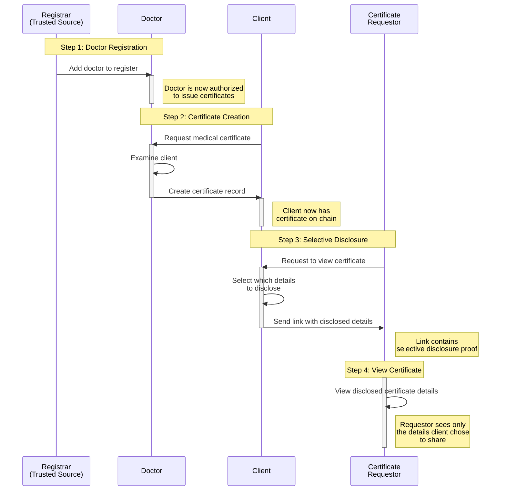
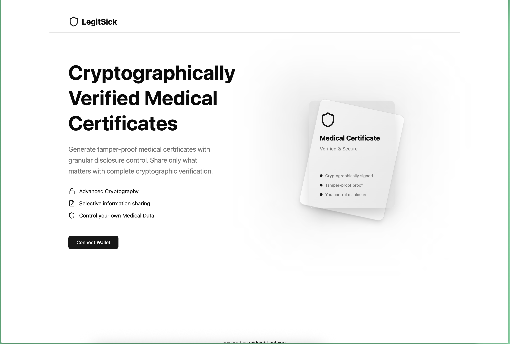
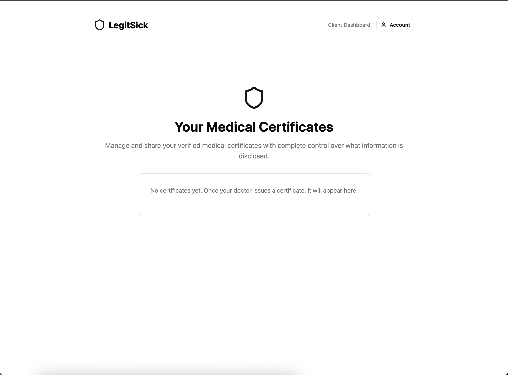
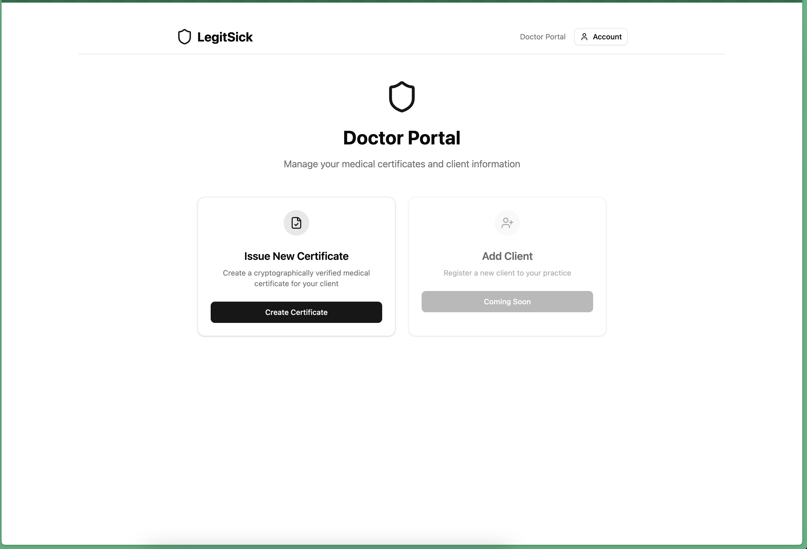
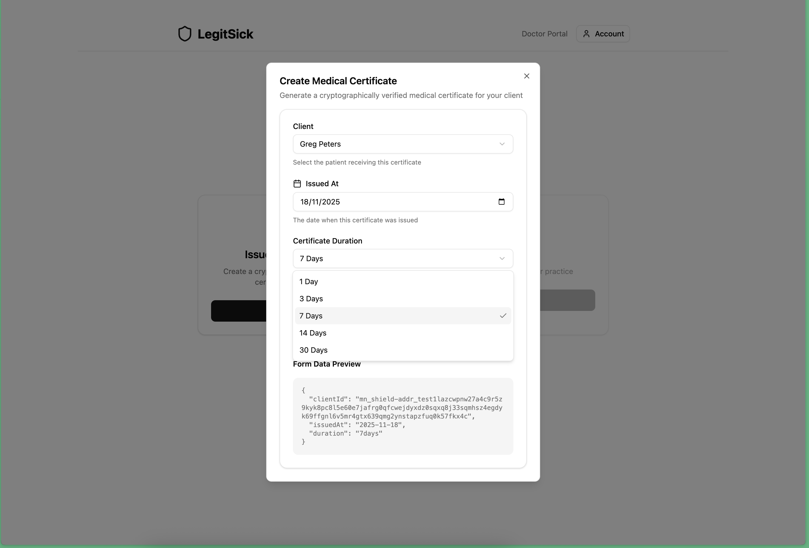

# midnight-summit-2025

My Repo for the MSH 2025

To run the proof server:

```bash
docker run -p 6300:6300 midnightnetwork/proof-server -- 'midnight-proof-server --network testnet'
```

### Core Flow

Here's a sequence diagram of the current flow:



### Current UI Status

The UI is under development - here is some screenshots:

<details>
  <summary>Home Page</summary>
  
</details>

<details>
  <summary>Patient Dashboard</summary>
  
</details>

<details>
  <summary>Doctor Dashboard</summary>
  
</details>

<details>
  <summary>Doctor Create Cert</summary>
  
</details>
